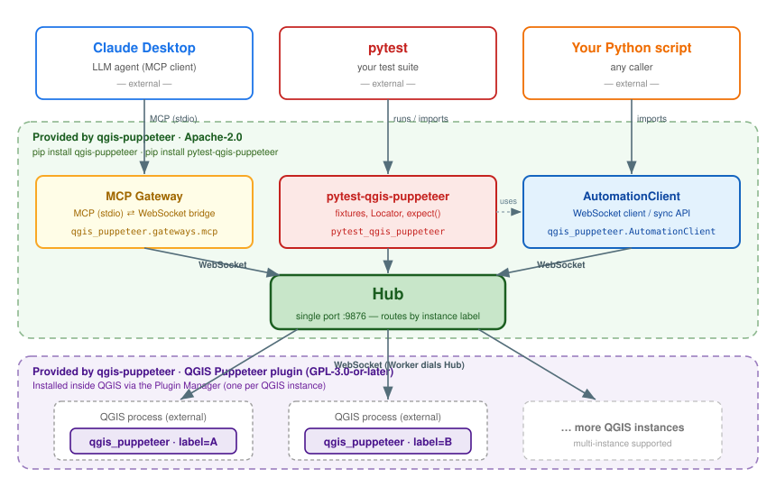

# qgis-puppeteer

> Control QGIS from Claude Desktop and pytest via WebSocket.

[](https://github.com/oruharo/qgis-puppeteer/actions/workflows/ci.yml)
[](https://opensource.org/licenses/Apache-2.0)
[](https://www.python.org/downloads/)

## What is this?

`qgis-puppeteer` is a remote-control framework for QGIS:

- **Claude Desktop / MCP integration** — let LLM agents control QGIS via the [Model Context Protocol](https://modelcontextprotocol.io/)
- **pytest E2E testing** — write Playwright-style E2E tests for QGIS plugins, including modal dialogs
- **Multi-instance support** — operate multiple QGIS processes from a single Hub
- **Direct Python API** — embed QGIS automation in any script

## Architecture



See [docs/architecture/0001-qgis-puppeteer-architecture.md](docs/architecture/0001-qgis-puppeteer-architecture.md) for full design (with the detailed diagram at [docs/architecture/assets/0001-architecture.svg](docs/architecture/assets/0001-architecture.svg)).

## Packages

| Package | Distributed via | Role | License |
|---|---|---|---|
| [qgis-puppeteer](packages/qgis-puppeteer/) | PyPI | Core: Hub / Worker / Client / MCP gateway | Apache-2.0 |
| [pytest-qgis-puppeteer](packages/pytest-qgis-puppeteer/) | PyPI | Pytest plugin for E2E testing QGIS | Apache-2.0 |
| [qgis_puppet](plugins/qgis_puppet/) | QGIS Plugin Repo | QGIS plugin (Worker) | GPL-3.0-or-later |

## Quick start

### For Claude Desktop users

> **Status:** pre-release. Until the first PyPI release, install directly from the
> `dev` branch (or replace `@dev` with a tag once tagged):
>
> ```bash
> pip install "qgis-puppeteer[mcp] @ git+https://github.com/oruharo/qgis-puppeteer.git@dev#subdirectory=packages/qgis-puppeteer"
> ```

After PyPI publication:

```bash
pip install "qgis-puppeteer[mcp]"
```

The `[mcp]` extra installs the MCP SDK the gateway imports; without it
`python -m qgis_puppeteer.gateways.mcp` fails with an ImportError.

Then install the `qgis_puppet` plugin into QGIS by copying `plugins/qgis_puppet/`
into your QGIS plugin directory (the QGIS Plugin Repository entry will be added
once the project is tagged).

In `claude_desktop_config.json`:
```json
{
  "mcpServers": {
    "qgis-puppeteer": {
      "command": "python",
      "args": ["-m", "qgis_puppeteer.gateways.mcp"]
    }
  }
}
```

Done. Claude can now call tools like `mcp__qgis-puppeteer__qgis_list_layers`.

### For pytest E2E testing

Pre-release (from `dev` branch):

```bash
pip install "pytest-qgis-puppeteer @ git+https://github.com/oruharo/qgis-puppeteer.git@dev#subdirectory=packages/pytest-qgis-puppeteer"
```

After PyPI publication:

```bash
pip install pytest-qgis-puppeteer
```

In your project's `pyproject.toml`:
```toml
[tool.pytest.ini_options]
qgis_bin = "C:/Program Files/QGIS 3.34/bin/qgis-bin.exe"
```

Write a test:
```python
def test_login(qgis):
    qgis.locator({"object_name": "username"}).fill("user")
    qgis.locator({"object_name": "password"}).fill("pass")
    qgis.locator({"object_name": "login_btn"}).click()
    qgis.wait_for_modal_closed(timeout_s=5.0)
    assert qgis.locator({"object_name": "status"}).get_text() == "OK"
```

## Documentation

- **[User Guide](docs/user-guide.md)** — install, quickstarts (Claude Desktop / pytest / Python), selector reference, Locator API, dialog handler, troubleshooting
- [QGIS Puppeteer Architecture (ADR-0001)](docs/architecture/0001-qgis-puppeteer-architecture.md) — Hub / Worker / WebSocket protocol design
- [E2E Test Architecture (ADR-0002)](docs/architecture/0002-e2e-test-architecture.md) — Locator, auto-wait, diagnostic bundle, Roadmap
- [Test Environments (ADR-0003)](docs/architecture/0003-test-environments.md) — declarative QGIS launch configurations per test set (partition model)
- [Inline spawn helper (ADR-0004)](docs/architecture/0004-inline-qgis-spawn-helper.md) — `spawn_qgis()` context manager for tests where QGIS startup options *are* the test subject
- [Label lifecycle & stable identity (ADR-0005)](docs/architecture/0005-label-lifecycle-and-stable-identity.md) — *Accepted*: same-label restart as a first-class flow; pid-independent instance_id; `launch_token` correlation; supersedes ADR-0001 §5 label/identity rules

## Roadmap

Forward-looking items are tracked in the ADRs:

- ADR-0001 `## Roadmap`: remote operation (TLS + token auth), `qgis_launch_instance` MCP tool, MCP `entry_points` mixin pattern, dynamic handler load/unload
- ADR-0002 `## Roadmap`: pytest-xdist parallel execution, multi-instance test scenarios, HTML summary reporter, signal-based test handlers, flaky auto-detection

## License

- Core (`qgis-puppeteer`) and pytest plugin (`pytest-qgis-puppeteer`): **Apache-2.0**
- QGIS plugin (`qgis_puppet`): **GPL-3.0-or-later**

See individual package `LICENSE` files for details.

## Contributing

Contributions welcome. Please file an issue first for non-trivial changes.
See [CONTRIBUTING.md](CONTRIBUTING.md) for repository layout, dev setup,
ADR workflow, and PR conventions.

A condensed [CHANGELOG](CHANGELOG.md) tracks user-visible changes per
release.
